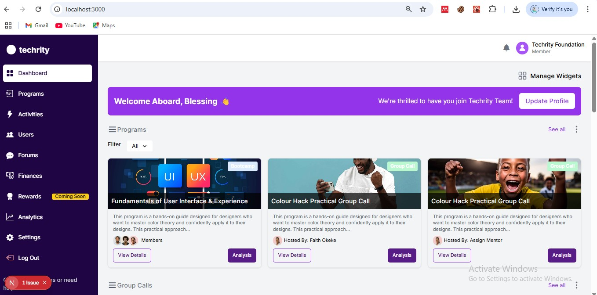
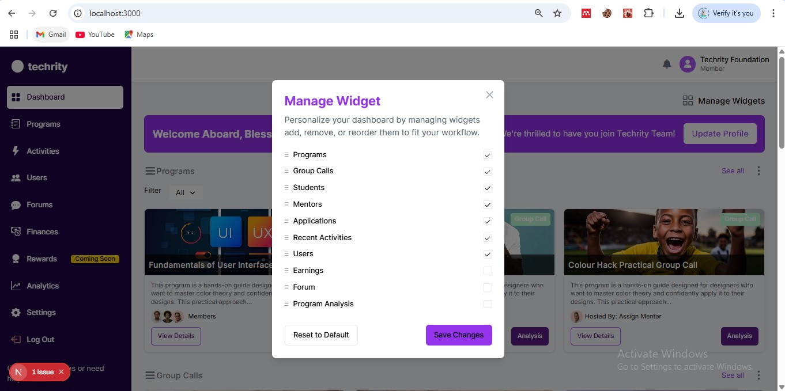

# Techrity Foundation Dashboard

A comprehensive dashboard for the Techrity Foundation, designed to manage educational programs, mentors, students, and other platform activities. This modern, responsive web application provides an intuitive interface for administrators to monitor and manage all aspects of the Techrity educational ecosystem.

,


## 📋 Table of Contents

- [Features](#features)
- [Tech Stack](#tech-stack)
- [Getting Started](#getting-started)
  - [Prerequisites](#prerequisites)
  - [Installation](#installation)
  - [Environment Variables](#environment-variables)
- [Project Structure](#project-structure)
- [Usage](#usage)
  - [Dashboard Overview](#dashboard-overview)
  - [Managing Programs](#managing-programs)
  - [Student Management](#student-management)
  - [Mentor Applications](#mentor-applications)
- [Customization](#customization)
  - [Widget Management](#widget-management)
  - [Theming](#theming)
- [API Documentation](#api-documentation)
- [Contributing](#contributing)
- [License](#license)
- [Acknowledgements](#acknowledgements)

## ✨ Features

- **Responsive Design**: Fully responsive dashboard that works seamlessly on desktop, tablet, and mobile devices
- **Interactive Sidebar**: Collapsible sidebar with desktop and mobile views
- **User Management**: Comprehensive tools for managing students, mentors, and applications
- **Program Management**: Create, edit, and monitor educational programs
- **Group Calls**: Schedule and manage virtual meetings and group calls
- **Analytics**: Visual representation of user statistics and platform activities
- **Real-time Updates**: Track recent activities and notifications
- **Customizable Widgets**: Personalize dashboard layout with widget management
- **Role-based Access Control**: Different views and permissions for admins, mentors, and students

## 🛠️ Tech Stack

- **Frontend Framework**: [Next.js](https://nextjs.org/) (App Router)
- **UI Components**: [shadcn/ui](https://ui.shadcn.com/)
- **Styling**: [Tailwind CSS](https://tailwindcss.com/)
- **Icons**: [Lucide React](https://lucide.dev/)
- **State Management**: React Context API
- **Authentication**: (To be implemented)
- **Data Fetching**: (To be implemented)

## 🚀 Getting Started

### Prerequisites

- Node.js 18.x or later
- npm or yarn
- Git

### Installation

1. Clone the repository:

```bash
git clone https://github.com/Bax-dev/mently-dashboard.git
cd techrity-dashboard

📁 Project Structure
----------------------


techrity-dashboard/
├── app/                    # Next.js App Router
│   ├── dashboard/          # Dashboard routes
│   │   ├── layout.tsx      # Dashboard layout with sidebar
│   │   ├── page.tsx        # Main dashboard page
│   │   └── [...]/          # Other dashboard routes
│   ├── api/                # API routes
│   ├── layout.tsx          # Root layout
│   └── page.tsx            # Landing page
├── components/             # React components
│   ├── dashboard/          # Dashboard-specific components
│   │   ├── sidebar/        # Sidebar components
│   │   └── widgets/        # Dashboard widgets
│   └── ui/                 # UI components (shadcn/ui)
├── hooks/                  # Custom React hooks
├── lib/                    # Utility functions
├── public/                 # Static assets
├── styles/                 # Global styles
├── types/                  # TypeScript type definitions
├── .env.local              # Environment variables
├── next.config.js          # Next.js configuration
├── package.json            # Project dependencies
├── tailwind.config.js      # Tailwind CSS configuration
└── tsconfig.json           # TypeScript configuration

📖 Usage
---------

### Dashboard Overview

The dashboard provides a comprehensive view of the Techrity platform, including:

- **Welcome Banner**: Personalized greeting for the logged-in user
- **Programs Widget**: Overview of active and upcoming educational programs
- **Group Calls Widget**: Schedule of upcoming and ongoing virtual meetings
- **Students Widget**: List of active students with progress tracking
- **Applications Widget**: Manage mentor applications
- **Mentors Widget**: View and interact with current mentors
- **Users Widget**: Visual representation of user statistics
- **Recent Activities Widget**: Timeline of recent platform activities

### Managing Programs

The Programs section allows administrators to:

1. View all active and upcoming programs
2. Filter programs by status
3. View program details including participants and progress
4. Create new programs (via the admin interface)
5. Edit existing program details

### Student Management

The Students section provides tools to:

1. View all enrolled students
2. Track individual student progress
3. Search for specific students
4. View detailed student profiles
5. Manage student enrollments

### Mentor Applications

The Applications section enables administrators to:

1. Review pending mentor applications
2. Accept or reject applications
3. View applicant details and qualifications
4. Communicate with potential mentors
