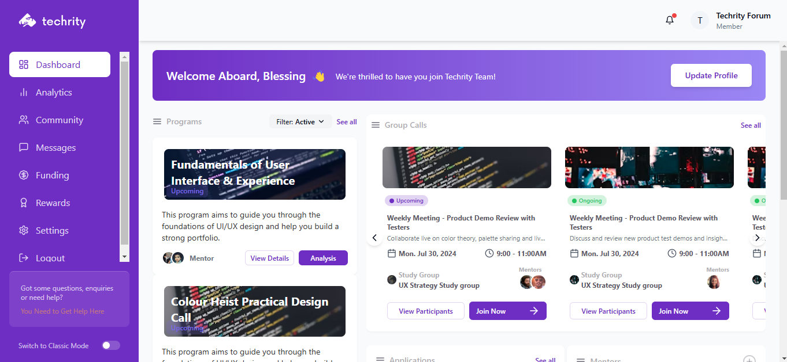

# Techrity Dashboard

# Submitted By: Rotimi Oluwafemi

- [GitHub](https://github.com/Itzfeminisce)
- [LinkedIn](https://linkedin.com/in/Itzfeminisce)
- [Portfolio](https://itzfeminisce.vercel.app)

A modern dashboard application built with React and TypeScript, featuring a clean UI with a purple theme.

## Tech Stack

- **React**: Frontend library for building user interfaces
- **TypeScript**: Static type-checking for JavaScript
- **React Router**: For navigation between different sections
- **Lucide Icons**: For consistent iconography throughout the application
- **Tailwind CSS**: For styling with utility classes

## Project Structure

The application follows a component-based architecture:

- `src/components/layout`: Contains layout components like Sidebar
- `src/mock-data.ts`: Contains mock data for development and testing

## Features

- **Responsive Sidebar**: Collapsible sidebar with navigation links
- **Dashboard Overview**: Main dashboard with program cards and statistics
- **Group Calls**: Interface for managing and joining video calls
- **Notifications System**: Real-time notification display

## Color Scheme

The application uses a custom color palette:
- Primary: Techrity Purple (`bg-techrity-purple`)
- Accent: Techrity Rating color for highlights
- Text: White with various opacity levels for hierarchy
- Background: Dark theme with subtle gradients

## Getting Started

1. Clone the repository
2. Install dependencies with `npm install`
3. Run the development server with `npm run dev`
4. Access the application at `http://localhost:5173`

## Screenshots

